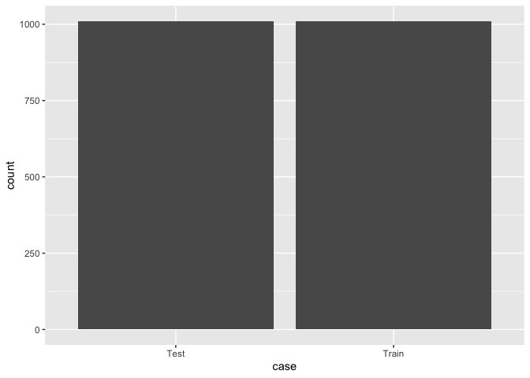
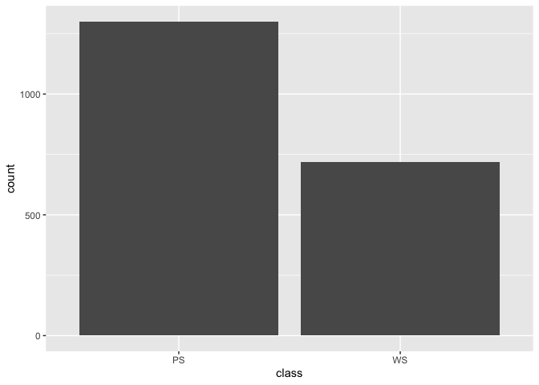
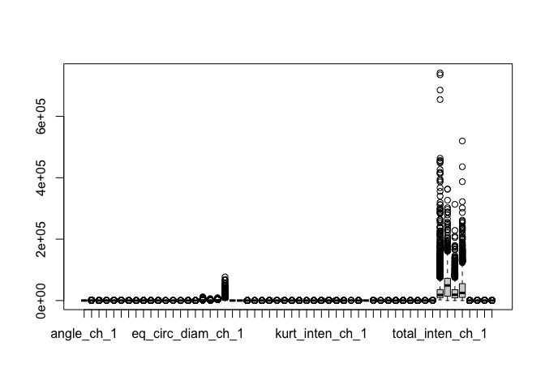
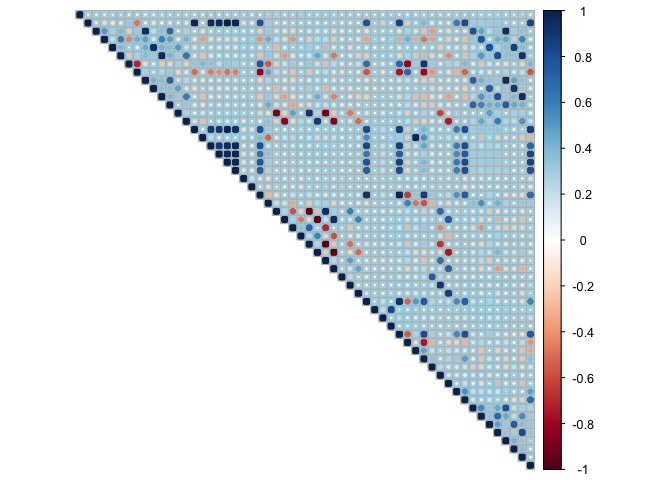
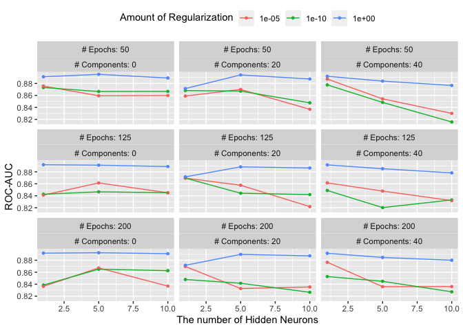

Modeling cells - quarto + EDA + tidymodels
================
Tural Sadigov
2022-08-06

We will be investigating ‘cells’ data from modeldata package in R. Lets
load all the packages we will be using.

``` r
library(modeldata)
library(tidymodels)
```

    ## ── Attaching packages ────────────────────────────────────── tidymodels 1.0.0 ──

    ## ✔ broom        1.0.0     ✔ rsample      1.0.0
    ## ✔ dials        1.0.0     ✔ tibble       3.1.8
    ## ✔ dplyr        1.0.9     ✔ tidyr        1.2.0
    ## ✔ ggplot2      3.3.6     ✔ tune         1.0.0
    ## ✔ infer        1.0.2     ✔ workflows    1.0.0
    ## ✔ parsnip      1.0.0     ✔ workflowsets 1.0.0
    ## ✔ purrr        0.3.4     ✔ yardstick    1.0.0
    ## ✔ recipes      1.0.1

    ## ── Conflicts ───────────────────────────────────────── tidymodels_conflicts() ──
    ## ✖ purrr::discard() masks scales::discard()
    ## ✖ dplyr::filter()  masks stats::filter()
    ## ✖ dplyr::lag()     masks stats::lag()
    ## ✖ recipes::step()  masks stats::step()
    ## • Search for functions across packages at https://www.tidymodels.org/find/

``` r
library(corrplot)
```

    ## corrplot 0.92 loaded

Let’s glimpse at the data.

``` r
data(cells)
glimpse(cells)
```

    ## Rows: 2,019
    ## Columns: 58
    ## $ case                         <fct> Test, Train, Train, Train, Test, Test, Te…
    ## $ class                        <fct> PS, PS, WS, PS, PS, WS, WS, PS, WS, WS, W…
    ## $ angle_ch_1                   <dbl> 143.247705, 133.752037, 106.646387, 69.15…
    ## $ area_ch_1                    <int> 185, 819, 431, 298, 285, 172, 177, 251, 4…
    ## $ avg_inten_ch_1               <dbl> 15.71186, 31.92327, 28.03883, 19.45614, 2…
    ## $ avg_inten_ch_2               <dbl> 4.954802, 206.878517, 116.315534, 102.294…
    ## $ avg_inten_ch_3               <dbl> 9.548023, 69.916880, 63.941748, 28.217544…
    ## $ avg_inten_ch_4               <dbl> 2.214689, 164.153453, 106.696602, 31.0280…
    ## $ convex_hull_area_ratio_ch_1  <dbl> 1.124509, 1.263158, 1.053310, 1.202625, 1…
    ## $ convex_hull_perim_ratio_ch_1 <dbl> 0.9196827, 0.7970801, 0.9354750, 0.865829…
    ## $ diff_inten_density_ch_1      <dbl> 29.51923, 31.87500, 32.48771, 26.73228, 3…
    ## $ diff_inten_density_ch_3      <dbl> 13.77564, 43.12228, 35.98577, 22.91732, 2…
    ## $ diff_inten_density_ch_4      <dbl> 6.826923, 79.308424, 51.357050, 26.393701…
    ## $ entropy_inten_ch_1           <dbl> 4.969781, 6.087592, 5.883557, 5.420065, 5…
    ## $ entropy_inten_ch_3           <dbl> 4.371017, 6.642761, 6.683000, 5.436732, 5…
    ## $ entropy_inten_ch_4           <dbl> 2.718884, 7.880155, 7.144601, 5.778329, 5…
    ## $ eq_circ_diam_ch_1            <dbl> 15.36954, 32.30558, 23.44892, 19.50279, 1…
    ## $ eq_ellipse_lwr_ch_1          <dbl> 3.060676, 1.558394, 1.375386, 3.391220, 2…
    ## $ eq_ellipse_oblate_vol_ch_1   <dbl> 336.9691, 2232.9055, 802.1945, 724.7143, …
    ## $ eq_ellipse_prolate_vol_ch_1  <dbl> 110.0963, 1432.8246, 583.2504, 213.7031, …
    ## $ eq_sphere_area_ch_1          <dbl> 742.1156, 3278.7256, 1727.4104, 1194.9320…
    ## $ eq_sphere_vol_ch_1           <dbl> 1900.996, 17653.525, 6750.985, 3884.084, …
    ## $ fiber_align_2_ch_3           <dbl> 1.000000, 1.487935, 1.300522, 1.220424, 1…
    ## $ fiber_align_2_ch_4           <dbl> 1.000000, 1.352374, 1.522316, 1.733250, 1…
    ## $ fiber_length_ch_1            <dbl> 26.98132, 64.28230, 21.14115, 43.14112, 3…
    ## $ fiber_width_ch_1             <dbl> 7.410365, 13.167079, 21.141150, 7.404412,…
    ## $ inten_cooc_asm_ch_3          <dbl> 0.011183899, 0.028051061, 0.006862315, 0.…
    ## $ inten_cooc_asm_ch_4          <dbl> 0.050448005, 0.012594975, 0.006141691, 0.…
    ## $ inten_cooc_contrast_ch_3     <dbl> 40.751777, 8.227953, 14.446074, 7.299457,…
    ## $ inten_cooc_contrast_ch_4     <dbl> 13.895439, 6.984046, 16.700843, 13.390884…
    ## $ inten_cooc_entropy_ch_3      <dbl> 7.199458, 6.822138, 7.580100, 6.312641, 6…
    ## $ inten_cooc_entropy_ch_4      <dbl> 5.249744, 7.098988, 7.671478, 7.197026, 5…
    ## $ inten_cooc_max_ch_3          <dbl> 0.07741935, 0.15321477, 0.02835052, 0.162…
    ## $ inten_cooc_max_ch_4          <dbl> 0.17197452, 0.07387141, 0.02319588, 0.077…
    ## $ kurt_inten_ch_1              <dbl> -0.656744087, -0.248769067, -0.293484630,…
    ## $ kurt_inten_ch_3              <dbl> -0.608058268, -0.330783900, 1.051281336, …
    ## $ kurt_inten_ch_4              <dbl> 0.7258145, -0.2652638, 0.1506140, -0.3472…
    ## $ length_ch_1                  <dbl> 26.20779, 47.21855, 28.14303, 37.85957, 3…
    ## $ neighbor_avg_dist_ch_1       <dbl> 370.4543, 174.4442, 158.4774, 206.3344, 2…
    ## $ neighbor_min_dist_ch_1       <dbl> 99.10349, 30.11114, 34.94477, 33.08030, 2…
    ## $ neighbor_var_dist_ch_1       <dbl> 127.96080, 81.38063, 90.43768, 116.89276,…
    ## $ perim_ch_1                   <dbl> 68.78338, 154.89876, 84.56460, 101.09107,…
    ## $ shape_bfr_ch_1               <dbl> 0.6651480, 0.5397584, 0.7243116, 0.589162…
    ## $ shape_lwr_ch_1               <dbl> 2.462450, 1.468181, 1.328408, 2.826854, 2…
    ## $ shape_p_2_a_ch_1             <dbl> 1.883006, 2.255810, 1.272193, 2.545840, 2…
    ## $ skew_inten_ch_1              <dbl> 0.45450484, 0.39870467, 0.47248709, 0.881…
    ## $ skew_inten_ch_3              <dbl> 0.46039340, 0.61973079, 0.97137879, 0.999…
    ## $ skew_inten_ch_4              <dbl> 1.2327736, 0.5272631, 0.3247065, 0.604439…
    ## $ spot_fiber_count_ch_3        <int> 1, 4, 2, 4, 1, 1, 0, 2, 1, 1, 1, 0, 0, 2,…
    ## $ spot_fiber_count_ch_4        <dbl> 5, 12, 7, 8, 8, 5, 5, 8, 12, 8, 5, 6, 7, …
    ## $ total_inten_ch_1             <int> 2781, 24964, 11552, 5545, 6603, 53779, 43…
    ## $ total_inten_ch_2             <dbl> 701, 160998, 47511, 28870, 30306, 107681,…
    ## $ total_inten_ch_3             <int> 1690, 54675, 26344, 8042, 5569, 21234, 20…
    ## $ total_inten_ch_4             <int> 392, 128368, 43959, 8843, 11037, 57231, 4…
    ## $ var_inten_ch_1               <dbl> 12.47468, 18.80923, 17.29564, 13.81897, 1…
    ## $ var_inten_ch_3               <dbl> 7.609035, 56.715352, 37.671053, 30.005643…
    ## $ var_inten_ch_4               <dbl> 2.714100, 118.388139, 49.470524, 24.74953…
    ## $ width_ch_1                   <dbl> 10.64297, 32.16126, 21.18553, 13.39283, 1…

Most of the variables are numerical (double and integer) measuring cell
properties. Case variable is the label for training and testing,, and
class variable which we will be predicting has two levels.

``` r
cells %>% 
  ggplot(aes(x = case)) +
  geom_bar()
```

<!-- -->

``` r
cells %>% 
  ggplot(aes(x = class)) +
  geom_bar()
```

<!-- -->

It seems that data is already split approximately 50-50 for training and
testing, and classes are not balanced. Dimensions of the data:

``` r
dim(cells)
```

    ## [1] 2019   58

Only 2K observations with 58 predictors. We could look at summary of
some variables in the data.

``` r
cells %>% 
  select(colnames(cells)[1:5]) %>% 
  summary()
```

    ##     case      class       angle_ch_1          area_ch_1      avg_inten_ch_1   
    ##  Test :1010   PS:1300   Min.   :  0.03088   Min.   : 150.0   Min.   :  15.16  
    ##  Train:1009   WS: 719   1st Qu.: 53.89221   1st Qu.: 193.0   1st Qu.:  35.36  
    ##                         Median : 90.58877   Median : 253.0   Median :  62.34  
    ##                         Mean   : 90.49340   Mean   : 320.3   Mean   : 126.07  
    ##                         3rd Qu.:126.68201   3rd Qu.: 362.5   3rd Qu.: 143.19  
    ##                         Max.   :179.93932   Max.   :2186.0   Max.   :1418.63

It does seem that many numerical predictors have positive skew. Classes
are distributed by approximately 65-35%.

``` r
cells %>% 
  select(where(is.numeric)) %>% 
  boxplot()
```

<!-- -->

Some predictors have many outliers and many predictors are not on the
same scale. Let’s look at the correlations between numerical predictors.

``` r
cells %>% 
  select(where(is.numeric)) %>%
  cor() %>% 
  corrplot::corrplot(method = 'circle', type = 'upper',
           bg="lightblue", tl.pos='n')
```

<!-- -->

This shows many pairs of predictors are highly correlated. We could drop
some and obtain maximum number of low correlated predictors using one of
tidymodels (recipe) step functions or apply PCA to extract features that
are not correlated at all. PCA can be done using step_pca of recipe
package.

First, remove case variable (tags for train and test).

``` r
cells <- 
  cells %>% 
  select(-case)
```

Choose 10-fold cross validation for hyper-parameter tuning.

``` r
set.seed(123)
cell_folds <- vfold_cv(data = cells, 
                       v = 10, 
                       repeats = 1)
```

We will be doing feature engineering first.

``` r
# model specifications with hyperparameters to be tuned
mlp_spec <- 
  mlp(hidden_units = tune(), 
      penalty = tune(), 
      epochs = tune()) %>% 
  set_engine("nnet", 
             trace = 0) %>% 
  set_mode("classification")

# recipe - make num predictors symmetric, normialize, applu pca
# with number of componnets to be tuned
# then normalize again
mlp_rec <-
  recipe(class ~ ., data = cells) %>%
  step_YeoJohnson(all_numeric_predictors()) %>% 
  step_normalize(all_numeric_predictors()) %>% 
  step_pca(all_numeric_predictors(), 
           num_comp = tune()) %>% 
  step_normalize(all_numeric_predictors())

# add both model and recipe to the workflow
mlp_wflow <- 
  workflow() %>% 
  add_model(mlp_spec) %>% 
  add_recipe(mlp_rec)
```

Extract the range for the hyper-parameters to be tuned in the model
object. Note that in the model specifications, we do have three
hyper-parameters: number of hidden units/neurons in the single hidden
layer, the penalty for the weight decay and number of epochs.

``` r
mlp_param <- 
  extract_parameter_set_dials(mlp_spec)
mlp_param %>% 
  extract_parameter_dials("hidden_units")
```

    ## # Hidden Units (quantitative)
    ## Range: [1, 10]

``` r
mlp_param %>% 
  extract_parameter_dials("penalty")
```

    ## Amount of Regularization (quantitative)
    ## Transformer: log-10 [1e-100, Inf]
    ## Range (transformed scale): [-10, 0]

``` r
mlp_param %>% 
  extract_parameter_dials("epochs")
```

    ## # Epochs (quantitative)
    ## Range: [10, 1000]

There is an additional hyper-parameter, number of principal components
in the recipe object.

``` r
mlp_pca_param <- 
  extract_parameter_set_dials(mlp_rec)
mlp_pca_param %>% 
  extract_parameter_dials('num_comp')
```

    ## # Components (quantitative)
    ## Range: [1, 4]

Lets create **`a regular grid`** for three parameters of the model/model
specification above.

``` r
tidyr::crossing(hidden_units = 1:3,
                penalty = c(0.0, 0.1),
                epochs = c(100, 200))
```

    ## # A tibble: 12 × 3
    ##    hidden_units penalty epochs
    ##           <int>   <dbl>  <dbl>
    ##  1            1     0      100
    ##  2            1     0      200
    ##  3            1     0.1    100
    ##  4            1     0.1    200
    ##  5            2     0      100
    ##  6            2     0      200
    ##  7            2     0.1    100
    ##  8            2     0.1    200
    ##  9            3     0      100
    ## 10            3     0      200
    ## 11            3     0.1    100
    ## 12            3     0.1    200

We can update our parameters’ ranges by first combining all four
parameter with the workflow.

``` r
mlp_param <- 
  mlp_wflow %>% 
  extract_parameter_set_dials() %>% 
  update(
    epochs = epochs(c(50, 200)),
    num_comp = num_comp(c(0, 40))
  )
```

Evaluate the grid using cross validation.

``` r
doParallel::registerDoParallel()
roc_res <- metric_set(roc_auc)
set.seed(145)
mlp_reg_tune <-
  mlp_wflow %>%
  tune_grid(cell_folds,
            grid = mlp_param %>% grid_regular(levels = 3),
            metrics = roc_res)
mlp_reg_tune
```

    ## # Tuning results
    ## # 10-fold cross-validation 
    ## # A tibble: 10 × 4
    ##    splits             id     .metrics          .notes          
    ##    <list>             <chr>  <list>            <list>          
    ##  1 <split [1817/202]> Fold01 <tibble [81 × 8]> <tibble [0 × 3]>
    ##  2 <split [1817/202]> Fold02 <tibble [81 × 8]> <tibble [0 × 3]>
    ##  3 <split [1817/202]> Fold03 <tibble [81 × 8]> <tibble [0 × 3]>
    ##  4 <split [1817/202]> Fold04 <tibble [81 × 8]> <tibble [0 × 3]>
    ##  5 <split [1817/202]> Fold05 <tibble [81 × 8]> <tibble [0 × 3]>
    ##  6 <split [1817/202]> Fold06 <tibble [81 × 8]> <tibble [0 × 3]>
    ##  7 <split [1817/202]> Fold07 <tibble [81 × 8]> <tibble [0 × 3]>
    ##  8 <split [1817/202]> Fold08 <tibble [81 × 8]> <tibble [0 × 3]>
    ##  9 <split [1817/202]> Fold09 <tibble [81 × 8]> <tibble [0 × 3]>
    ## 10 <split [1818/201]> Fold10 <tibble [81 × 8]> <tibble [0 × 3]>

Plot the results.

``` r
autoplot(mlp_reg_tune)+
  theme(legend.position = "top") +
  ylab('ROC-AUC') +
  xlab ('The number of Hidden Neurons')
```

<!-- -->

Show best results!

``` r
mlp_reg_tune %>% 
  show_best() %>% 
  select(-.estimator)
```

    ## # A tibble: 5 × 9
    ##   hidden_units penalty epochs num_comp .metric  mean     n std_err .config      
    ##          <int>   <dbl>  <int>    <int> <chr>   <dbl> <int>   <dbl> <chr>        
    ## 1            5       1     50        0 roc_auc 0.895    10 0.00844 Preprocessor…
    ## 2            5       1     50       20 roc_auc 0.894    10 0.00788 Preprocessor…
    ## 3            5       1    200        0 roc_auc 0.893    10 0.00879 Preprocessor…
    ## 4            1       1     50       40 roc_auc 0.892    10 0.00865 Preprocessor…
    ## 5            1       1    125        0 roc_auc 0.892    10 0.00879 Preprocessor…
