Introduction to ‘tidymodels’ metapackage for Machine Learning
================
Tural Sadigov
2022-08-06

### Libraries and data

Load the main library.

``` r
library(tidymodels)
```

Make sure conflicts are handled by tidymodels

``` r
tidymodels_prefer(quiet = T)
```

Load the data Ames housing data (which some say is the new iris!) from
‘**modeldata**’ package.

``` r
library(modeldata) # This is also loaded by the tidymodels package
data(ames)
dim(ames)
```

    ## [1] 2930   74

Lets explore the data set.

``` r
glimpse(ames)
```

**`GOAL:`** Using various other features of houses, we would like to
predict the sale price. Since we do have all sale prices in the data,
this will be supervised regression algorithm.

### EDA

Distribution of the outcome and log-transformed outcome.

``` r
# outcome
ames %>% 
  ggplot(aes(x = Sale_Price)) + 
  geom_histogram(aes(y = ..density..),
                 bins = 50, 
                 col= "white") +
  xlab('Sale Prices ($)') +
  geom_density(lwd = 1.5,
               linetype = 1,
               colour = 2)
```

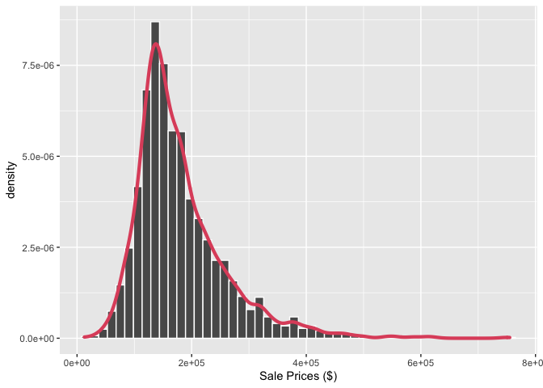<!-- -->

``` r
# log-outcome
ames %>% 
  ggplot(aes(x = Sale_Price)) + 
  geom_histogram(aes(y = ..density..), 
                 bins = 50, 
                 col= "white") +
  scale_x_log10() +
  xlab('Log - Sale Prices ($)') +
  geom_density(lwd = 1.5,
               linetype = 1,
               colour = 2)
```

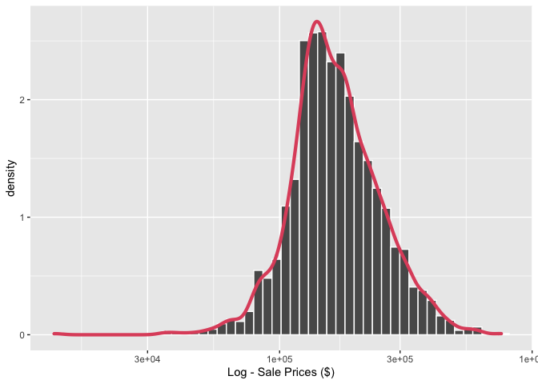<!-- -->

Distribution of sale prices depending whether there is a central air or
not.

``` r
ames %>% 
  ggplot(aes(x = Sale_Price)) + 
  geom_histogram(aes(y = ..density..),
                 bins = 50, 
                 col= "white") +
  facet_wrap(~Central_Air) +
  xlab('Sale Prices ($)') +
  geom_density(lwd = 1.5,
               linetype = 1,
               colour = 2)
```

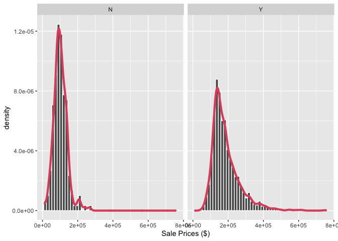<!-- -->

Distribution of log-transforemed sale prices depending whether there is
a central air or not.

``` r
ames %>% 
  ggplot(aes(x = Sale_Price)) + 
  geom_histogram(aes(y = ..density..),
                 bins = 20, 
                 col= "white") +
  scale_x_log10() +
  facet_wrap(~Central_Air) +
  xlab('Sale Prices ($)') +
  geom_density(lwd = 1.5,
               linetype = 1,
               colour = 2)
```

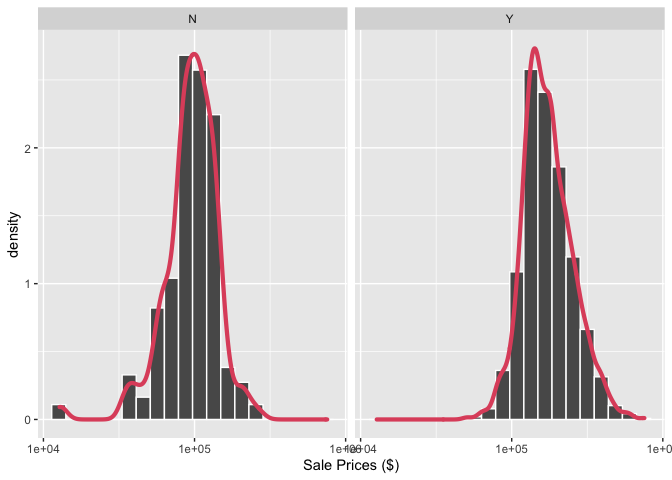<!-- -->

Is the outcome normal? Is the log-outcome normal?

``` r
ames %>% 
  ggplot(aes(sample = Sale_Price))+ 
  stat_qq() +
  stat_qq_line()
```

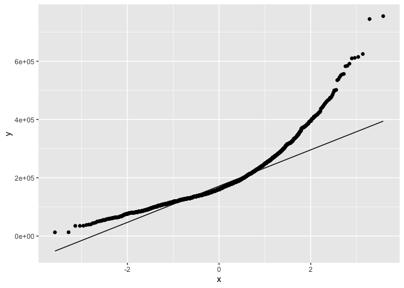<!-- -->

``` r
ames %>% 
  mutate(Sale_Price = log(Sale_Price)) %>% 
  ggplot(aes(sample = Sale_Price))+ 
  stat_qq() +
  stat_qq_line()
```

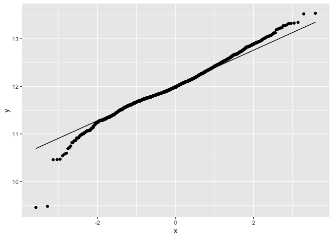<!-- -->

We could also investigate quantile-quantile plot for the sale price and
its transformed version for each level of a categorical variable such as
whether there is a central air or not in the house.

``` r
ames %>% 
  ggplot(aes(sample = Sale_Price, color = Central_Air))+ 
  stat_qq() +
  stat_qq_line()
```

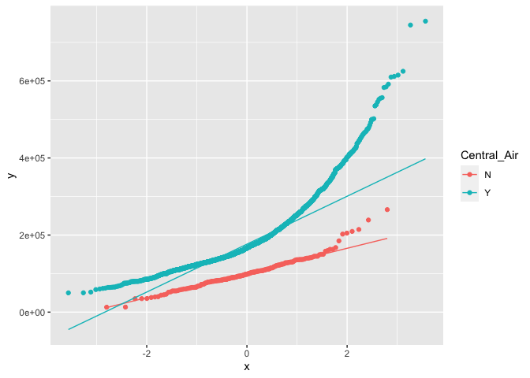<!-- -->

``` r
ames %>% 
  mutate(Sale_Price = log(Sale_Price)) %>% 
  ggplot(aes(sample = Sale_Price, color = Central_Air))+ 
  stat_qq() +
  stat_qq_line()
```

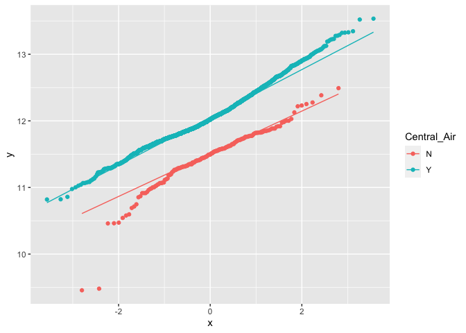<!-- -->

Since log-outcome is more symmetric, particularly in the middle regime,
so we will use the transformed sale prices as our new outcome for the
rest of the project.

``` r
ames <- 
  ames %>% 
  mutate(Sale_Price = log10(Sale_Price))
```

Lets look at geography of the houses. Here we look at the scatterplot of
latitude vs longitude, meaning exact physical location.

``` r
ames %>% 
  select(Neighborhood, Longitude, Latitude) %>% 
  ggplot(aes(x = Longitude, 
             y = Latitude, 
             color = Neighborhood)) +
  geom_point() +
  theme(legend.position="bottom")
```

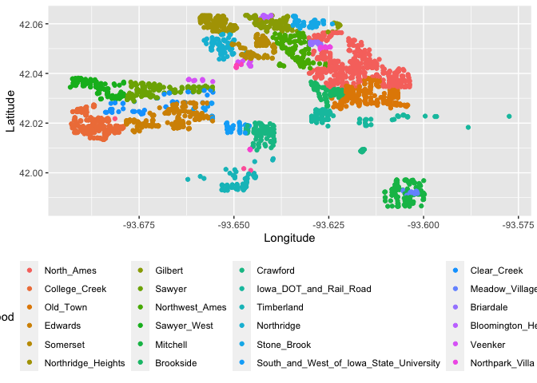<!-- -->

There is a huge gap in the middle that corresponds to Iowa University.
Look at regions Northridge and Somerset closely.

``` r
ames %>% 
  select(Neighborhood, Longitude, Latitude) %>% 
  filter(Neighborhood == 'Northridge' | Neighborhood == 'Somerset') %>% 
  ggplot(aes(x = Longitude, 
             y = Latitude, 
             color = Neighborhood)) +
  geom_point() +
  theme(legend.position="bottom")
```

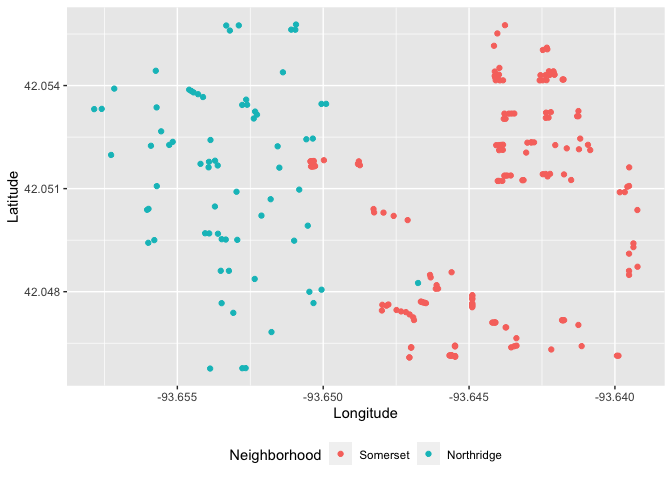<!-- -->

Look at Crawford.

``` r
ames %>% 
  select(Neighborhood, Longitude, Latitude) %>% 
  filter(Neighborhood == 'Crawford') %>% 
  ggplot(aes(x = Longitude,
             y = Latitude, 
             color = Neighborhood)) +
  geom_point() +
  theme(legend.position="none")
```

<!-- -->

Crawford has this isolated small cluster all the way in south-east. Look
at railroad neighborhood.

``` r
ames %>% 
  select(Neighborhood, Longitude, Latitude) %>% 
  filter(Neighborhood == 'Iowa_DOT_and_Rail_Road') %>% 
  ggplot(aes(x = Longitude, 
             y = Latitude, 
             color = Neighborhood)) +
  geom_point() +
  theme(legend.position="none")
```

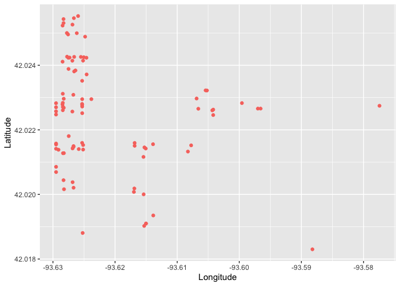<!-- -->

Railroad neighborhood has houses in east and south east that is far away
from everyone else.

# Data spending (budget)

Lets split the data using stratified sampling where strata are coming
from the sale prices, outcome we like to predict.

``` r
set.seed(2022)
ames_split <- initial_split(ames, 
                            prop = 0.80, 
                            strata = Sale_Price)
ames_split
```

    ## <Training/Testing/Total>
    ## <2342/588/2930>

What is this new split object?

``` r
typeof(ames_split)
```

    ## [1] "list"

``` r
class(ames_split)
```

    ## [1] "initial_split" "mc_split"      "rsplit"

It is an ‘rsplit’ object. Keep that in mind. We can use tidy function on
it.

``` r
tidy(ames_split)
```

    ## # A tibble: 2,930 × 2
    ##      Row Data    
    ##    <int> <chr>   
    ##  1     1 Analysis
    ##  2     2 Analysis
    ##  3     3 Analysis
    ##  4     4 Analysis
    ##  5     5 Analysis
    ##  6     6 Analysis
    ##  7     7 Analysis
    ##  8     8 Analysis
    ##  9     9 Analysis
    ## 10    10 Analysis
    ## # … with 2,920 more rows
    ## # ℹ Use `print(n = ...)` to see more rows

Lets use the rsplit object to actually get the split data.

``` r
ames_train <- training(ames_split)
ames_test  <-  testing(ames_split)
dim(ames_train)
```

    ## [1] 2342   74

``` r
dim(ames_test)
```

    ## [1] 588  74

``` r
ames_split
```

    ## <Training/Testing/Total>
    ## <2342/588/2930>

# Modeling with parsnip

We will fit a linear model to predict sale price of a property as
function of only two variables: longitude and latitude.

First, we setup the model specifications.

``` r
lm_model <- 
  linear_reg() %>% 
  set_engine('lm')
lm_model
```

    ## Linear Regression Model Specification (regression)
    ## 
    ## Computational engine: lm

Then, we fit it using my favorite interface, the formula
(
vs
)!

``` r
lm_form_fit <- 
  lm_model %>% 
  fit(Sale_Price~Longitude + Latitude, 
      data = ames_train)
lm_form_fit
```

    ## parsnip model object
    ## 
    ## 
    ## Call:
    ## stats::lm(formula = Sale_Price ~ Longitude + Latitude, data = data)
    ## 
    ## Coefficients:
    ## (Intercept)    Longitude     Latitude  
    ##    -301.956       -2.073        2.689

``` r
tidy(lm_form_fit)
```

    ## # A tibble: 3 × 5
    ##   term        estimate std.error statistic  p.value
    ##   <chr>          <dbl>     <dbl>     <dbl>    <dbl>
    ## 1 (Intercept)  -302.      14.6       -20.7 2.56e-87
    ## 2 Longitude      -2.07     0.131     -15.9 7.99e-54
    ## 3 Latitude        2.69     0.182      14.8 3.26e-47

Or, we can do the same thing with predictors separate from the outcome,

interface.

``` r
lm_xy_fit <- 
  lm_model %>% 
  fit_xy(x = ames_train %>% select(Longitude, Latitude),
         y = ames_train %>% pull(Sale_Price))
lm_xy_fit
```

    ## parsnip model object
    ## 
    ## 
    ## Call:
    ## stats::lm(formula = ..y ~ ., data = data)
    ## 
    ## Coefficients:
    ## (Intercept)    Longitude     Latitude  
    ##    -301.956       -2.073        2.689

``` r
tidy(lm_xy_fit)
```

    ## # A tibble: 3 × 5
    ##   term        estimate std.error statistic  p.value
    ##   <chr>          <dbl>     <dbl>     <dbl>    <dbl>
    ## 1 (Intercept)  -302.      14.6       -20.7 2.56e-87
    ## 2 Longitude      -2.07     0.131     -15.9 7.99e-54
    ## 3 Latitude        2.69     0.182      14.8 3.26e-47

Admittedly, one can do it all in one chunk. But separation makes the
whole modeling process more modular.

``` r
lm_form_fit_tidy <- 
  linear_reg() %>% 
  set_engine('lm') %>% 
  fit(Sale_Price~Longitude + Latitude, 
      data = ames_train) %>% 
  tidy()
lm_form_fit_tidy
```

    ## # A tibble: 3 × 5
    ##   term        estimate std.error statistic  p.value
    ##   <chr>          <dbl>     <dbl>     <dbl>    <dbl>
    ## 1 (Intercept)  -302.      14.6       -20.7 2.56e-87
    ## 2 Longitude      -2.07     0.131     -15.9 7.99e-54
    ## 3 Latitude        2.69     0.182      14.8 3.26e-47

## Obtaining the results

Fitted object is a parsnip object, and we might want to extract other
info from it.

``` r
# extract the fit model
lm_form_fit %>% 
  extract_fit_engine()
```

    ## 
    ## Call:
    ## stats::lm(formula = Sale_Price ~ Longitude + Latitude, data = data)
    ## 
    ## Coefficients:
    ## (Intercept)    Longitude     Latitude  
    ##    -301.956       -2.073        2.689

Summary.

``` r
# extract the summmary of the model
lm_form_fit %>% 
  extract_fit_engine() %>% 
  summary()
```

    ## 
    ## Call:
    ## stats::lm(formula = Sale_Price ~ Longitude + Latitude, data = data)
    ## 
    ## Residuals:
    ##      Min       1Q   Median       3Q      Max 
    ## -1.02743 -0.09898 -0.01601  0.09858  0.58095 
    ## 
    ## Coefficients:
    ##              Estimate Std. Error t value Pr(>|t|)    
    ## (Intercept) -301.9558    14.6081  -20.67   <2e-16 ***
    ## Longitude     -2.0731     0.1308  -15.85   <2e-16 ***
    ## Latitude       2.6894     0.1822   14.76   <2e-16 ***
    ## ---
    ## Signif. codes:  0 '***' 0.001 '**' 0.01 '*' 0.05 '.' 0.1 ' ' 1
    ## 
    ## Residual standard error: 0.1631 on 2339 degrees of freedom
    ## Multiple R-squared:  0.1636, Adjusted R-squared:  0.1629 
    ## F-statistic: 228.8 on 2 and 2339 DF,  p-value: < 2.2e-16

But probably the best way to look at the coefficients and their
statistics, is to use tidy().

``` r
tidy(lm_form_fit)
```

    ## # A tibble: 3 × 5
    ##   term        estimate std.error statistic  p.value
    ##   <chr>          <dbl>     <dbl>     <dbl>    <dbl>
    ## 1 (Intercept)  -302.      14.6       -20.7 2.56e-87
    ## 2 Longitude      -2.07     0.131     -15.9 7.99e-54
    ## 3 Latitude        2.69     0.182      14.8 3.26e-47

## Predictions

Lets make some predictions. First, slice the first 5 rows of the test
set.

``` r
ames_test_small <- 
  ames_test %>% 
  slice(1:5)
ames_test_small
```

    ## # A tibble: 5 × 74
    ##   MS_SubC…¹ MS_Zo…² Lot_F…³ Lot_A…⁴ Street Alley Lot_S…⁵ Land_…⁶ Utili…⁷ Lot_C…⁸
    ##   <fct>     <fct>     <dbl>   <int> <fct>  <fct> <fct>   <fct>   <fct>   <fct>  
    ## 1 Two_Stor… Reside…      75   10000 Pave   No_A… Slight… Lvl     AllPub  Corner 
    ## 2 Two_Stor… Reside…      63    8402 Pave   No_A… Slight… Lvl     AllPub  Inside 
    ## 3 Split_Fo… Reside…      85   10625 Pave   No_A… Regular Lvl     AllPub  Inside 
    ## 4 One_Stor… Reside…      65    8450 Pave   No_A… Regular Lvl     AllPub  Inside 
    ## 5 Two_Stor… Reside…      21    1680 Pave   No_A… Regular Lvl     AllPub  Inside 
    ## # … with 64 more variables: Land_Slope <fct>, Neighborhood <fct>,
    ## #   Condition_1 <fct>, Condition_2 <fct>, Bldg_Type <fct>, House_Style <fct>,
    ## #   Overall_Cond <fct>, Year_Built <int>, Year_Remod_Add <int>,
    ## #   Roof_Style <fct>, Roof_Matl <fct>, Exterior_1st <fct>, Exterior_2nd <fct>,
    ## #   Mas_Vnr_Type <fct>, Mas_Vnr_Area <dbl>, Exter_Cond <fct>, Foundation <fct>,
    ## #   Bsmt_Cond <fct>, Bsmt_Exposure <fct>, BsmtFin_Type_1 <fct>,
    ## #   BsmtFin_SF_1 <dbl>, BsmtFin_Type_2 <fct>, BsmtFin_SF_2 <dbl>, …
    ## # ℹ Use `colnames()` to see all variable names

Now make predictions.

``` r
predict(object = lm_form_fit, 
        new_data = ames_test_small)
```

    ## # A tibble: 5 × 1
    ##   .pred
    ##   <dbl>
    ## 1  5.27
    ## 2  5.27
    ## 3  5.25
    ## 4  5.25
    ## 5  5.23

Lets merge these new predictions with the original data.

``` r
ames_test_small %>% 
  select(Sale_Price) %>% 
  bind_cols(predict(lm_form_fit, 
                    ames_test_small)) 
```

    ## # A tibble: 5 × 2
    ##   Sale_Price .pred
    ##        <dbl> <dbl>
    ## 1       5.25  5.27
    ## 2       5.26  5.27
    ## 3       5.23  5.25
    ## 4       5.15  5.25
    ## 5       4.98  5.23

We could now examine how well we did in those predictions, plot the
preecited values versus the observed values and more.

But for a second, imagine that instead of linear regression model, we
would like to fit a decision tree. Look how the modeling process change
below.

``` r
tree_model <- ##### ONLY DIFFERNCES ARE IN MODEL SPECIFICATIONS
  decision_tree(min_n = 2) %>% 
  set_engine("rpart") %>% 
  set_mode("regression")

tree_fit <- 
  tree_model %>% 
  fit(Sale_Price ~ Longitude + Latitude, 
      data = ames_train)

ames_test_small %>% 
  select(Sale_Price) %>% 
  bind_cols(predict(tree_fit, 
                    ames_test_small)) 
```

    ## # A tibble: 5 × 2
    ##   Sale_Price .pred
    ##        <dbl> <dbl>
    ## 1       5.25  5.31
    ## 2       5.26  5.31
    ## 3       5.23  5.31
    ## 4       5.15  5.15
    ## 5       4.98  5.15

That is, there is only model specification changes. The rest is the
same. That uniformity in the modeling for various algorithms is the true
power of tidymodels.

# Model WORKFLOW

Create model specifications and add it to the workflow.

``` r
lm_model <- 
  linear_reg() %>% 
  set_engine("lm")
lm_wflow <- 
  workflow() %>% 
  add_model(lm_model)
lm_wflow
```

    ## ══ Workflow ════════════════════════════════════════════════════════════════════
    ## Preprocessor: None
    ## Model: linear_reg()
    ## 
    ## ── Model ───────────────────────────────────────────────────────────────────────
    ## Linear Regression Model Specification (regression)
    ## 
    ## Computational engine: lm

Add preprocessor.

``` r
lm_wflow <- 
  lm_wflow %>% 
  add_formula(Sale_Price ~ Longitude + Latitude)
lm_wflow
```

    ## ══ Workflow ════════════════════════════════════════════════════════════════════
    ## Preprocessor: Formula
    ## Model: linear_reg()
    ## 
    ## ── Preprocessor ────────────────────────────────────────────────────────────────
    ## Sale_Price ~ Longitude + Latitude
    ## 
    ## ── Model ───────────────────────────────────────────────────────────────────────
    ## Linear Regression Model Specification (regression)
    ## 
    ## Computational engine: lm

Now fit.

``` r
lm_fit <- 
  fit(object = lm_wflow, 
      data = ames_train)
lm_fit
```

    ## ══ Workflow [trained] ══════════════════════════════════════════════════════════
    ## Preprocessor: Formula
    ## Model: linear_reg()
    ## 
    ## ── Preprocessor ────────────────────────────────────────────────────────────────
    ## Sale_Price ~ Longitude + Latitude
    ## 
    ## ── Model ───────────────────────────────────────────────────────────────────────
    ## 
    ## Call:
    ## stats::lm(formula = ..y ~ ., data = data)
    ## 
    ## Coefficients:
    ## (Intercept)    Longitude     Latitude  
    ##    -301.956       -2.073        2.689

``` r
tidy(lm_fit)
```

    ## # A tibble: 3 × 5
    ##   term        estimate std.error statistic  p.value
    ##   <chr>          <dbl>     <dbl>     <dbl>    <dbl>
    ## 1 (Intercept)  -302.      14.6       -20.7 2.56e-87
    ## 2 Longitude      -2.07     0.131     -15.9 7.99e-54
    ## 3 Latitude        2.69     0.182      14.8 3.26e-47

Make predictions on TRAINED WORKFLOW.

``` r
predict(object = lm_fit, 
        new_data = ames_test %>% slice(1:5))
```

    ## # A tibble: 5 × 1
    ##   .pred
    ##   <dbl>
    ## 1  5.27
    ## 2  5.27
    ## 3  5.25
    ## 4  5.25
    ## 5  5.23

## What if we would like to look at more than one model/preprocessor?

We use WORKFLOWSETS! We define various formulas that we are interested
in.

``` r
location <- list(
  longitude = Sale_Price ~ Longitude,
  latitude = Sale_Price ~ Latitude,
  coords = Sale_Price ~ Longitude + Latitude,
  neighborhood = Sale_Price ~ Neighborhood
)
location
```

    ## $longitude
    ## Sale_Price ~ Longitude
    ## 
    ## $latitude
    ## Sale_Price ~ Latitude
    ## 
    ## $coords
    ## Sale_Price ~ Longitude + Latitude
    ## 
    ## $neighborhood
    ## Sale_Price ~ Neighborhood

Then use workflowsets package.

``` r
library(workflowsets)
location_models <- workflow_set(preproc = location, 
                                models = list(lm = lm_model))
location_models
```

    ## # A workflow set/tibble: 4 × 4
    ##   wflow_id        info             option    result    
    ##   <chr>           <list>           <list>    <list>    
    ## 1 longitude_lm    <tibble [1 × 4]> <opts[0]> <list [0]>
    ## 2 latitude_lm     <tibble [1 × 4]> <opts[0]> <list [0]>
    ## 3 coords_lm       <tibble [1 × 4]> <opts[0]> <list [0]>
    ## 4 neighborhood_lm <tibble [1 × 4]> <opts[0]> <list [0]>

This is a tibble that contains multiple column-lists. Lets look into
one.

``` r
location_models$info[[1]]
```

    ## # A tibble: 1 × 4
    ##   workflow   preproc model      comment
    ##   <list>     <chr>   <chr>      <chr>  
    ## 1 <workflow> formula linear_reg ""

Even this one is a tibble with column-list. Lets dive in further to see
the workflow.

``` r
location_models$info[[3]][[1]]
```

    ## [[1]]
    ## ══ Workflow ════════════════════════════════════════════════════════════════════
    ## Preprocessor: Formula
    ## Model: linear_reg()
    ## 
    ## ── Preprocessor ────────────────────────────────────────────────────────────────
    ## Sale_Price ~ Longitude + Latitude
    ## 
    ## ── Model ───────────────────────────────────────────────────────────────────────
    ## Linear Regression Model Specification (regression)
    ## 
    ## Computational engine: lm

There is an easier way to get to the specific workflow using the
following function.

``` r
extract_workflow(x = location_models, 
                 id = "coords_lm")
```

    ## ══ Workflow ════════════════════════════════════════════════════════════════════
    ## Preprocessor: Formula
    ## Model: linear_reg()
    ## 
    ## ── Preprocessor ────────────────────────────────────────────────────────────────
    ## Sale_Price ~ Longitude + Latitude
    ## 
    ## ── Model ───────────────────────────────────────────────────────────────────────
    ## Linear Regression Model Specification (regression)
    ## 
    ## Computational engine: lm

Let’s create model fits for each formula and save them in a new column
called `fit`. We’ll use basic **dplyr** and **purrr** operations.

``` r
location_models <-
   location_models %>%
   mutate(fit = map(info, ~ fit(.x$workflow[[1]], 
                                ames_train)))
location_models
```

    ## # A workflow set/tibble: 4 × 5
    ##   wflow_id        info             option    result     fit       
    ##   <chr>           <list>           <list>    <list>     <list>    
    ## 1 longitude_lm    <tibble [1 × 4]> <opts[0]> <list [0]> <workflow>
    ## 2 latitude_lm     <tibble [1 × 4]> <opts[0]> <list [0]> <workflow>
    ## 3 coords_lm       <tibble [1 × 4]> <opts[0]> <list [0]> <workflow>
    ## 4 neighborhood_lm <tibble [1 × 4]> <opts[0]> <list [0]> <workflow>

``` r
location_models$fit[[1]]
```

    ## ══ Workflow [trained] ══════════════════════════════════════════════════════════
    ## Preprocessor: Formula
    ## Model: linear_reg()
    ## 
    ## ── Preprocessor ────────────────────────────────────────────────────────────────
    ## Sale_Price ~ Longitude
    ## 
    ## ── Model ───────────────────────────────────────────────────────────────────────
    ## 
    ## Call:
    ## stats::lm(formula = ..y ~ ., data = data)
    ## 
    ## Coefficients:
    ## (Intercept)    Longitude  
    ##    -184.340       -2.024

  
Assume that we have concluded our model selection and have a final
model. last_fit() function will fit the chosen model to the whole
training set (meaning, either validation or resamples from cross
validations are joined), and then evaluate the model on the testing set.
For that, we need to provide the chosen model/workflow and the original
split which is an rsplit object.

``` r
final_lm_res <- last_fit(object = lm_wflow, 
                         split = ames_split)
final_lm_res
```

    ## # Resampling results
    ## # Manual resampling 
    ## # A tibble: 1 × 6
    ##   splits             id               .metrics .notes   .predictions .workflow 
    ##   <list>             <chr>            <list>   <list>   <list>       <list>    
    ## 1 <split [2342/588]> train/test split <tibble> <tibble> <tibble>     <workflow>

Extract the workflow from previous tibble that has column-lists.

``` r
fitted_lm_wflow <- extract_workflow(final_lm_res)
fitted_lm_wflow
```

    ## ══ Workflow [trained] ══════════════════════════════════════════════════════════
    ## Preprocessor: Formula
    ## Model: linear_reg()
    ## 
    ## ── Preprocessor ────────────────────────────────────────────────────────────────
    ## Sale_Price ~ Longitude + Latitude
    ## 
    ## ── Model ───────────────────────────────────────────────────────────────────────
    ## 
    ## Call:
    ## stats::lm(formula = ..y ~ ., data = data)
    ## 
    ## Coefficients:
    ## (Intercept)    Longitude     Latitude  
    ##    -301.956       -2.073        2.689

Look at performance metrics and make predictions on the test data.

``` r
# metrics
collect_metrics(final_lm_res)
```

    ## # A tibble: 2 × 4
    ##   .metric .estimator .estimate .config             
    ##   <chr>   <chr>          <dbl> <chr>               
    ## 1 rmse    standard       0.153 Preprocessor1_Model1
    ## 2 rsq     standard       0.212 Preprocessor1_Model1

``` r
# predictions
collect_predictions(final_lm_res) %>% 
  slice(1:5)
```

    ## # A tibble: 5 × 5
    ##   id               .pred  .row Sale_Price .config             
    ##   <chr>            <dbl> <int>      <dbl> <chr>               
    ## 1 train/test split  5.27    11       5.25 Preprocessor1_Model1
    ## 2 train/test split  5.27    13       5.26 Preprocessor1_Model1
    ## 3 train/test split  5.25    22       5.23 Preprocessor1_Model1
    ## 4 train/test split  5.25    26       5.15 Preprocessor1_Model1
    ## 5 train/test split  5.23    30       4.98 Preprocessor1_Model1

Admittedly, metrics do not look great for the testing data.

## Using RECIPE package for preprosessing/feature engineering

``` r
simple_ames <- 
  recipe(Sale_Price ~ Neighborhood + Gr_Liv_Area + Year_Built + Bldg_Type,
         data = ames_train) %>%
  step_log(Gr_Liv_Area, base = 10) %>% 
  step_dummy(all_nominal_predictors())
simple_ames
```

    ## Recipe
    ## 
    ## Inputs:
    ## 
    ##       role #variables
    ##    outcome          1
    ##  predictor          4
    ## 
    ## Operations:
    ## 
    ## Log transformation on Gr_Liv_Area
    ## Dummy variables from all_nominal_predictors()

Add recipe we just created to the lm_wflow, but make sure you remove the
old formula/variables so that recipe can have its own formula.

``` r
lm_wflow <- 
  lm_wflow %>% 
  remove_formula() %>% 
  add_recipe(simple_ames)
lm_wflow
```

    ## ══ Workflow ════════════════════════════════════════════════════════════════════
    ## Preprocessor: Recipe
    ## Model: linear_reg()
    ## 
    ## ── Preprocessor ────────────────────────────────────────────────────────────────
    ## 2 Recipe Steps
    ## 
    ## • step_log()
    ## • step_dummy()
    ## 
    ## ── Model ───────────────────────────────────────────────────────────────────────
    ## Linear Regression Model Specification (regression)
    ## 
    ## Computational engine: lm

Now we fit.

``` r
lm_fit <- fit(object = lm_wflow, 
              data = ames_train)
print(tidy(lm_fit), n = 10)
```

    ## # A tibble: 35 × 5
    ##    term                             estimate std.error statistic  p.value
    ##    <chr>                               <dbl>     <dbl>     <dbl>    <dbl>
    ##  1 (Intercept)                     -1.22      0.234      -5.21   2.00e- 7
    ##  2 Gr_Liv_Area                      0.662     0.0144     46.0    0       
    ##  3 Year_Built                       0.00221   0.000118   18.8    3.61e-73
    ##  4 Neighborhood_College_Creek       0.00832   0.00837     0.994  3.20e- 1
    ##  5 Neighborhood_Old_Town           -0.0243    0.00842    -2.89   3.91e- 3
    ##  6 Neighborhood_Edwards            -0.0432    0.00773    -5.60   2.43e- 8
    ##  7 Neighborhood_Somerset            0.0406    0.00983     4.14   3.65e- 5
    ##  8 Neighborhood_Northridge_Heights  0.121     0.0103     11.8    3.76e-31
    ##  9 Neighborhood_Gilbert            -0.0409    0.00965    -4.24   2.32e- 5
    ## 10 Neighborhood_Sawyer              0.000693  0.00832     0.0833 9.34e- 1
    ## # … with 25 more rows
    ## # ℹ Use `print(n = ...)` to see more rows

We predict using test data, but note that predict automatically uses the
same transformations from the training data on the test data.

``` r
predict(object = lm_fit,
        new_data = ames_test %>% slice(1:3))
```

    ## Warning in predict.lm(object = object$fit, newdata = new_data, type =
    ## "response"): prediction from a rank-deficient fit may be misleading

    ## # A tibble: 3 × 1
    ##   .pred
    ##   <dbl>
    ## 1  5.27
    ## 2  5.25
    ## 3  5.17

Extract fitted/trained recipe.

``` r
lm_fit %>% 
  extract_recipe(estimated = T)
```

    ## Recipe
    ## 
    ## Inputs:
    ## 
    ##       role #variables
    ##    outcome          1
    ##  predictor          4
    ## 
    ## Training data contained 2342 data points and no missing data.
    ## 
    ## Operations:
    ## 
    ## Log transformation on Gr_Liv_Area [trained]
    ## Dummy variables from Neighborhood, Bldg_Type [trained]

Extract tidy summary.

``` r
lm_fit %>% 
  # This returns the parsnip object:
  extract_fit_parsnip() %>% 
  # Now tidy the linear model object:
  tidy() %>% 
  slice(1:5)
```

    ## # A tibble: 5 × 5
    ##   term                       estimate std.error statistic  p.value
    ##   <chr>                         <dbl>     <dbl>     <dbl>    <dbl>
    ## 1 (Intercept)                -1.22     0.234       -5.21  2.00e- 7
    ## 2 Gr_Liv_Area                 0.662    0.0144      46.0   0       
    ## 3 Year_Built                  0.00221  0.000118    18.8   3.61e-73
    ## 4 Neighborhood_College_Creek  0.00832  0.00837      0.994 3.20e- 1
    ## 5 Neighborhood_Old_Town      -0.0243   0.00842     -2.89  3.91e- 3

## What to do with categorical variables?

``` r
ames %>% 
  ggplot(aes(x = Neighborhood)) + 
  geom_bar() +
  coord_flip()
```

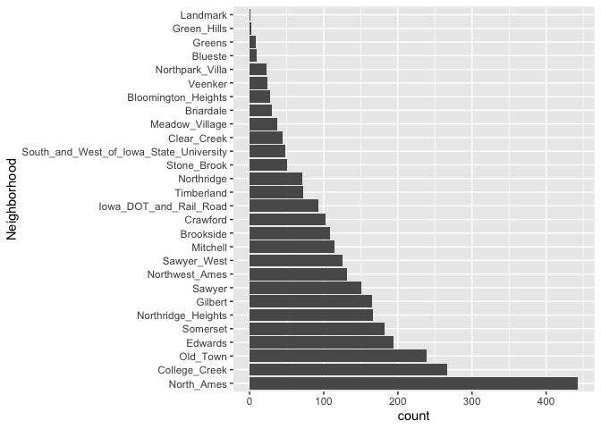<!-- -->

Lets add the bottom 1% of the cases into single factor called ‘other’.

``` r
simple_ames <- 
  recipe(Sale_Price ~ Neighborhood + Gr_Liv_Area + Year_Built + Bldg_Type,
         data = ames_train) %>%
  step_log(Gr_Liv_Area, base = 10) %>% 
  step_other(Neighborhood, threshold = 0.01) %>% 
  step_dummy(all_nominal_predictors())
simple_ames
```

    ## Recipe
    ## 
    ## Inputs:
    ## 
    ##       role #variables
    ##    outcome          1
    ##  predictor          4
    ## 
    ## Operations:
    ## 
    ## Log transformation on Gr_Liv_Area
    ## Collapsing factor levels for Neighborhood
    ## Dummy variables from all_nominal_predictors()

Interactions?

``` r
ggplot(ames_train, aes(x = Gr_Liv_Area, y = 10^Sale_Price)) + 
  geom_point(alpha = .2) + 
  facet_wrap(~ Bldg_Type) + 
  geom_smooth(method = lm, formula = y ~ x, se = FALSE, color = "lightblue") + 
  scale_x_log10() + 
  scale_y_log10() + 
  labs(x = "Gross Living Area", y = "Sale Price (USD)")
```

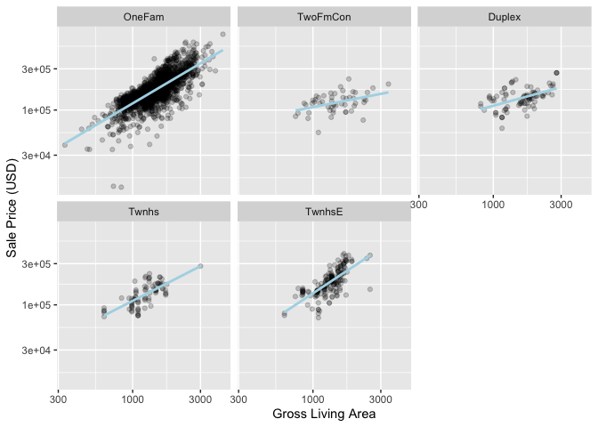<!-- -->

Lets add interaction between Gross Living Area and Building type. First,
create dummies and then add interactions. Not the other way around like
in base R.

``` r
ames_rec <- 
  recipe(Sale_Price ~ Neighborhood + Gr_Liv_Area + Year_Built + Bldg_Type + 
           Latitude + Longitude, data = ames_train) %>%
  step_log(Gr_Liv_Area, base = 10) %>% 
  step_other(Neighborhood, threshold = 0.01, id = "my_id") %>% 
  step_dummy(all_nominal_predictors()) %>% 
  step_interact( ~ Gr_Liv_Area:starts_with("Bldg_Type_") ) %>% 
  step_ns(Latitude, Longitude, deg_free = 20)

tidy(simple_ames)
```

    ## # A tibble: 3 × 6
    ##   number operation type  trained skip  id         
    ##    <int> <chr>     <chr> <lgl>   <lgl> <chr>      
    ## 1      1 step      log   FALSE   FALSE log_m9UZR  
    ## 2      2 step      other FALSE   FALSE other_Xe9DH
    ## 3      3 step      dummy FALSE   FALSE dummy_kTP2Z

Fit again using new recipe.

``` r
lm_wflow <- 
  workflow() %>% 
  add_model(spec = lm_model) %>% 
  add_recipe(recipe = ames_rec)

lm_fit <- fit(object = lm_wflow, 
              data = ames_train)
tidy(lm_fit)
```

    ## # A tibble: 72 × 5
    ##    term                            estimate std.error statistic   p.value
    ##    <chr>                              <dbl>     <dbl>     <dbl>     <dbl>
    ##  1 (Intercept)                     -0.757    0.297       -2.55  1.08e-  2
    ##  2 Gr_Liv_Area                      0.668    0.0157      42.5   3.53e-291
    ##  3 Year_Built                       0.00200  0.000138    14.5   1.89e- 45
    ##  4 Neighborhood_College_Creek      -0.0177   0.0328      -0.541 5.89e-  1
    ##  5 Neighborhood_Old_Town           -0.0445   0.0124      -3.59  3.33e-  4
    ##  6 Neighborhood_Edwards            -0.0630   0.0269      -2.34  1.92e-  2
    ##  7 Neighborhood_Somerset            0.0700   0.0190       3.68  2.38e-  4
    ##  8 Neighborhood_Northridge_Heights  0.129    0.0272       4.76  2.11e-  6
    ##  9 Neighborhood_Gilbert             0.0215   0.0214       1.00  3.16e-  1
    ## 10 Neighborhood_Sawyer             -0.0832   0.0256      -3.25  1.15e-  3
    ## # … with 62 more rows
    ## # ℹ Use `print(n = ...)` to see more rows

# Metrics

``` r
ames_test_res <- predict(object = lm_fit, 
                         new_data = ames_test %>% select(-Sale_Price))
ames_test_res
```

    ## # A tibble: 588 × 1
    ##    .pred
    ##    <dbl>
    ##  1  5.26
    ##  2  5.25
    ##  3  5.13
    ##  4  5.16
    ##  5  4.99
    ##  6  5.49
    ##  7  5.43
    ##  8  5.56
    ##  9  5.46
    ## 10  5.36
    ## # … with 578 more rows
    ## # ℹ Use `print(n = ...)` to see more rows

Bind predictions with observed values.

``` r
ames_test_res <- bind_cols(ames_test_res, ames_test %>% select(Sale_Price))
ames_test_res
```

    ## # A tibble: 588 × 2
    ##    .pred Sale_Price
    ##    <dbl>      <dbl>
    ##  1  5.26       5.25
    ##  2  5.25       5.26
    ##  3  5.13       5.23
    ##  4  5.16       5.15
    ##  5  4.99       4.98
    ##  6  5.49       5.49
    ##  7  5.43       5.34
    ##  8  5.56       5.51
    ##  9  5.46       5.51
    ## 10  5.36       5.31
    ## # … with 578 more rows
    ## # ℹ Use `print(n = ...)` to see more rows

Plot the predictions versus observations.

``` r
ames_test_res %>% 
  ggplot(aes(x = Sale_Price, y = .pred)) +
  geom_point(size = 2, alpha = 0.5) +
  geom_abline(lty = 2) +
  labs(x = 'Sale Price (log10)', 
       y = 'Predicted Price (log10)', 
       title = 'Does predictions match with reality?') +
  coord_obs_pred()
```

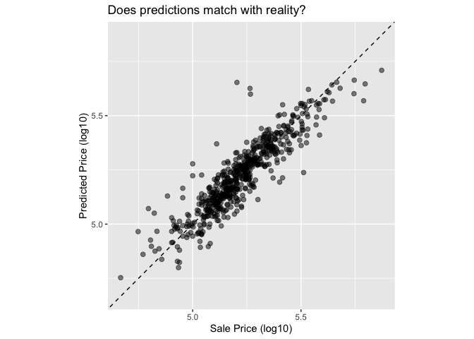<!-- -->

Calculate Root Mean Square Error.

``` r
y = ames_test_res$Sale_Price
yhat = ames_test_res$.pred
rmse = sqrt(mean((y-yhat)^2))
rmse
```

    ## [1] 0.0745144

OR use the function.

``` r
# rsme_vec
rmse_vec(truth = y, 
         estimate = yhat)
```

    ## [1] 0.0745144

``` r
# rmse
rmse(data = ames_test_res, 
     truth = Sale_Price, 
     estimate = .pred)
```

    ## # A tibble: 1 × 3
    ##   .metric .estimator .estimate
    ##   <chr>   <chr>          <dbl>
    ## 1 rmse    standard      0.0745

``` r
# tidyverse dialect
ames_test_res %>% 
  rmse(Sale_Price, .pred)
```

    ## # A tibble: 1 × 3
    ##   .metric .estimator .estimate
    ##   <chr>   <chr>          <dbl>
    ## 1 rmse    standard      0.0745

Multiple metrics, all at once.

``` r
ames_metrics <- metric_set(yardstick::rmse, 
                           yardstick::rsq, 
                           yardstick::mae,
                           yardstick::ccc)
ames_metrics(ames_test_res, 
             truth = Sale_Price, 
             estimate = .pred)
```

    ## # A tibble: 4 × 3
    ##   .metric .estimator .estimate
    ##   <chr>   <chr>          <dbl>
    ## 1 rmse    standard      0.0745
    ## 2 rsq     standard      0.816 
    ## 3 mae     standard      0.0534
    ## 4 ccc     standard      0.903

# Resampling: v-fold Cross Validation

``` r
set.seed(123)
ames_folds <- vfold_cv(data = ames_train, 
                       v = 10)
ames_folds
```

    ## #  10-fold cross-validation 
    ## # A tibble: 10 × 2
    ##    splits             id    
    ##    <list>             <chr> 
    ##  1 <split [2107/235]> Fold01
    ##  2 <split [2107/235]> Fold02
    ##  3 <split [2108/234]> Fold03
    ##  4 <split [2108/234]> Fold04
    ##  5 <split [2108/234]> Fold05
    ##  6 <split [2108/234]> Fold06
    ##  7 <split [2108/234]> Fold07
    ##  8 <split [2108/234]> Fold08
    ##  9 <split [2108/234]> Fold09
    ## 10 <split [2108/234]> Fold10

``` r
class(ames_folds)
```

    ## [1] "vfold_cv"   "rset"       "tbl_df"     "tbl"        "data.frame"

Note that created object is a tibble with a column-list. Dive in.

``` r
ames_folds$splits[[1]]
```

    ## <Analysis/Assess/Total>
    ## <2107/235/2342>

This object is both rsplit object as well as vfold_split object. One can
apply analysis or assessment function to get to the resampled data.

``` r
analysis(ames_folds$splits[[1]])
```

    ## # A tibble: 2,107 × 74
    ##    MS_Sub…¹ MS_Zo…² Lot_F…³ Lot_A…⁴ Street Alley Lot_S…⁵ Land_…⁶ Utili…⁷ Lot_C…⁸
    ##    <fct>    <fct>     <dbl>   <int> <fct>  <fct> <fct>   <fct>   <fct>   <fct>  
    ##  1 One_Sto… Reside…      80   11622 Pave   No_A… Regular Lvl     AllPub  Inside 
    ##  2 One_Sto… Reside…      70    8400 Pave   No_A… Regular Lvl     AllPub  Corner 
    ##  3 One_Sto… Reside…      70   10500 Pave   No_A… Regular Lvl     AllPub  FR2    
    ##  4 Two_Sto… Reside…      21    1680 Pave   No_A… Regular Lvl     AllPub  Inside 
    ##  5 Two_Sto… Reside…      21    1680 Pave   No_A… Regular Lvl     AllPub  Inside 
    ##  6 One_Sto… Reside…      53    4043 Pave   No_A… Regular Lvl     AllPub  Inside 
    ##  7 One_Sto… Reside…      24    2280 Pave   No_A… Regular Lvl     AllPub  FR2    
    ##  8 One_Sto… Reside…      55    7892 Pave   No_A… Regular Lvl     AllPub  Inside 
    ##  9 One_Sto… Reside…      50    7175 Pave   No_A… Regular Lvl     AllPub  Inside 
    ## 10 One_Sto… Reside…      70    9800 Pave   No_A… Regular Lvl     AllPub  Corner 
    ## # … with 2,097 more rows, 64 more variables: Land_Slope <fct>,
    ## #   Neighborhood <fct>, Condition_1 <fct>, Condition_2 <fct>, Bldg_Type <fct>,
    ## #   House_Style <fct>, Overall_Cond <fct>, Year_Built <int>,
    ## #   Year_Remod_Add <int>, Roof_Style <fct>, Roof_Matl <fct>,
    ## #   Exterior_1st <fct>, Exterior_2nd <fct>, Mas_Vnr_Type <fct>,
    ## #   Mas_Vnr_Area <dbl>, Exter_Cond <fct>, Foundation <fct>, Bsmt_Cond <fct>,
    ## #   Bsmt_Exposure <fct>, BsmtFin_Type_1 <fct>, BsmtFin_SF_1 <dbl>, …
    ## # ℹ Use `print(n = ...)` to see more rows, and `colnames()` to see all variable names

Or using tidyverse dialect:

``` r
ames_folds$splits[[1]] %>% 
  analysis()
```

    ## # A tibble: 2,107 × 74
    ##    MS_Sub…¹ MS_Zo…² Lot_F…³ Lot_A…⁴ Street Alley Lot_S…⁵ Land_…⁶ Utili…⁷ Lot_C…⁸
    ##    <fct>    <fct>     <dbl>   <int> <fct>  <fct> <fct>   <fct>   <fct>   <fct>  
    ##  1 One_Sto… Reside…      80   11622 Pave   No_A… Regular Lvl     AllPub  Inside 
    ##  2 One_Sto… Reside…      70    8400 Pave   No_A… Regular Lvl     AllPub  Corner 
    ##  3 One_Sto… Reside…      70   10500 Pave   No_A… Regular Lvl     AllPub  FR2    
    ##  4 Two_Sto… Reside…      21    1680 Pave   No_A… Regular Lvl     AllPub  Inside 
    ##  5 Two_Sto… Reside…      21    1680 Pave   No_A… Regular Lvl     AllPub  Inside 
    ##  6 One_Sto… Reside…      53    4043 Pave   No_A… Regular Lvl     AllPub  Inside 
    ##  7 One_Sto… Reside…      24    2280 Pave   No_A… Regular Lvl     AllPub  FR2    
    ##  8 One_Sto… Reside…      55    7892 Pave   No_A… Regular Lvl     AllPub  Inside 
    ##  9 One_Sto… Reside…      50    7175 Pave   No_A… Regular Lvl     AllPub  Inside 
    ## 10 One_Sto… Reside…      70    9800 Pave   No_A… Regular Lvl     AllPub  Corner 
    ## # … with 2,097 more rows, 64 more variables: Land_Slope <fct>,
    ## #   Neighborhood <fct>, Condition_1 <fct>, Condition_2 <fct>, Bldg_Type <fct>,
    ## #   House_Style <fct>, Overall_Cond <fct>, Year_Built <int>,
    ## #   Year_Remod_Add <int>, Roof_Style <fct>, Roof_Matl <fct>,
    ## #   Exterior_1st <fct>, Exterior_2nd <fct>, Mas_Vnr_Type <fct>,
    ## #   Mas_Vnr_Area <dbl>, Exter_Cond <fct>, Foundation <fct>, Bsmt_Cond <fct>,
    ## #   Bsmt_Exposure <fct>, BsmtFin_Type_1 <fct>, BsmtFin_SF_1 <dbl>, …
    ## # ℹ Use `print(n = ...)` to see more rows, and `colnames()` to see all variable names

## JUST VALIDATION

``` r
set.seed(1002)
val_set <- validation_split(data = ames_train, 
                            prop = 3/4)
val_set
```

    ## # Validation Set Split (0.75/0.25)  
    ## # A tibble: 1 × 2
    ##   splits             id        
    ##   <list>             <chr>     
    ## 1 <split [1756/586]> validation

``` r
class(val_set)
```

    ## [1] "validation_split" "rset"             "tbl_df"           "tbl"             
    ## [5] "data.frame"

``` r
val_set$splits[[1]]
```

    ## <Training/Validation/Total>
    ## <1756/586/2342>

## Bootstrap sampling

``` r
set.seed(2022)
boot_samples <- bootstraps(data = ames_train, 
                           times = 5)
assessment(boot_samples$splits[[1]])
```

    ## # A tibble: 847 × 74
    ##    MS_Sub…¹ MS_Zo…² Lot_F…³ Lot_A…⁴ Street Alley Lot_S…⁵ Land_…⁶ Utili…⁷ Lot_C…⁸
    ##    <fct>    <fct>     <dbl>   <int> <fct>  <fct> <fct>   <fct>   <fct>   <fct>  
    ##  1 One_Sto… Reside…      70    8400 Pave   No_A… Regular Lvl     AllPub  Corner 
    ##  2 Two_Sto… Reside…      21    1680 Pave   No_A… Regular Lvl     AllPub  Inside 
    ##  3 One_Sto… Reside…      53    4043 Pave   No_A… Regular Lvl     AllPub  Inside 
    ##  4 One_Sto… Reside…      24    2280 Pave   No_A… Regular Lvl     AllPub  FR2    
    ##  5 Duplex_… Reside…      68    8930 Pave   No_A… Regular Lvl     AllPub  Inside 
    ##  6 Duplex_… Reside…      98   13260 Pave   No_A… Slight… Lvl     AllPub  Inside 
    ##  7 One_Sto… Reside…      80    9920 Pave   No_A… Regular Lvl     AllPub  Inside 
    ##  8 Two_Fam… Reside…      70   13587 Pave   No_A… Regular Lvl     AllPub  Inside 
    ##  9 One_Sto… Reside…      68    7922 Pave   No_A… Regular Lvl     AllPub  Inside 
    ## 10 One_Sto… Reside…      65    7898 Pave   No_A… Regular Lvl     AllPub  Corner 
    ## # … with 837 more rows, 64 more variables: Land_Slope <fct>,
    ## #   Neighborhood <fct>, Condition_1 <fct>, Condition_2 <fct>, Bldg_Type <fct>,
    ## #   House_Style <fct>, Overall_Cond <fct>, Year_Built <int>,
    ## #   Year_Remod_Add <int>, Roof_Style <fct>, Roof_Matl <fct>,
    ## #   Exterior_1st <fct>, Exterior_2nd <fct>, Mas_Vnr_Type <fct>,
    ## #   Mas_Vnr_Area <dbl>, Exter_Cond <fct>, Foundation <fct>, Bsmt_Cond <fct>,
    ## #   Bsmt_Exposure <fct>, BsmtFin_Type_1 <fct>, BsmtFin_SF_1 <dbl>, …
    ## # ℹ Use `print(n = ...)` to see more rows, and `colnames()` to see all variable names

``` r
class(boot_samples$splits[[1]])
```

    ## [1] "boot_split" "rsplit"

# Estimating model performances using resampling

First lets fit a random forest model.

``` r
rf_model <- 
  rand_forest(trees = 1000) %>% 
  set_engine("ranger") %>% 
  set_mode("regression")

rf_wflow <- 
  workflow() %>% 
  add_formula( Sale_Price ~ Neighborhood + Gr_Liv_Area + Year_Built + Bldg_Type +
                 Latitude + Longitude) %>% 
  add_model(rf_model) 

rf_fit <- 
  rf_wflow %>% 
  fit(data = ames_train)
```

Now we fit resamples.

``` r
keep_pred <- control_resamples(save_pred = TRUE, 
                               save_workflow = TRUE)

set.seed(234)
doParallel::registerDoParallel() # lets parallelize the computation
rf_res <- 
  rf_wflow %>% 
  fit_resamples(resamples = ames_folds, 
                control = keep_pred)
rf_res
```

    ## # Resampling results
    ## # 10-fold cross-validation 
    ## # A tibble: 10 × 5
    ##    splits             id     .metrics         .notes           .predictions
    ##    <list>             <chr>  <list>           <list>           <list>      
    ##  1 <split [2107/235]> Fold01 <tibble [2 × 4]> <tibble [0 × 3]> <tibble>    
    ##  2 <split [2107/235]> Fold02 <tibble [2 × 4]> <tibble [0 × 3]> <tibble>    
    ##  3 <split [2108/234]> Fold03 <tibble [2 × 4]> <tibble [0 × 3]> <tibble>    
    ##  4 <split [2108/234]> Fold04 <tibble [2 × 4]> <tibble [0 × 3]> <tibble>    
    ##  5 <split [2108/234]> Fold05 <tibble [2 × 4]> <tibble [0 × 3]> <tibble>    
    ##  6 <split [2108/234]> Fold06 <tibble [2 × 4]> <tibble [0 × 3]> <tibble>    
    ##  7 <split [2108/234]> Fold07 <tibble [2 × 4]> <tibble [0 × 3]> <tibble>    
    ##  8 <split [2108/234]> Fold08 <tibble [2 × 4]> <tibble [0 × 3]> <tibble>    
    ##  9 <split [2108/234]> Fold09 <tibble [2 × 4]> <tibble [0 × 3]> <tibble>    
    ## 10 <split [2108/234]> Fold10 <tibble [2 × 4]> <tibble [0 × 3]> <tibble>

Note that this object above has many list columns one of which contains
metrics as tibbles for each resample. We can look at average performance
metrics below:

``` r
collect_metrics(rf_res)
```

    ## # A tibble: 2 × 6
    ##   .metric .estimator   mean     n std_err .config             
    ##   <chr>   <chr>       <dbl> <int>   <dbl> <chr>               
    ## 1 rmse    standard   0.0731    10 0.00322 Preprocessor1_Model1
    ## 2 rsq     standard   0.833     10 0.00886 Preprocessor1_Model1

If one wants to get individual metrics for each sample, we can do that
as below.

``` r
collect_metrics(x = rf_res, summarize = F)
```

    ## # A tibble: 20 × 5
    ##    id     .metric .estimator .estimate .config             
    ##    <chr>  <chr>   <chr>          <dbl> <chr>               
    ##  1 Fold01 rmse    standard      0.0748 Preprocessor1_Model1
    ##  2 Fold01 rsq     standard      0.826  Preprocessor1_Model1
    ##  3 Fold02 rmse    standard      0.0692 Preprocessor1_Model1
    ##  4 Fold02 rsq     standard      0.813  Preprocessor1_Model1
    ##  5 Fold03 rmse    standard      0.0588 Preprocessor1_Model1
    ##  6 Fold03 rsq     standard      0.879  Preprocessor1_Model1
    ##  7 Fold04 rmse    standard      0.0733 Preprocessor1_Model1
    ##  8 Fold04 rsq     standard      0.840  Preprocessor1_Model1
    ##  9 Fold05 rmse    standard      0.0684 Preprocessor1_Model1
    ## 10 Fold05 rsq     standard      0.830  Preprocessor1_Model1
    ## 11 Fold06 rmse    standard      0.0778 Preprocessor1_Model1
    ## 12 Fold06 rsq     standard      0.844  Preprocessor1_Model1
    ## 13 Fold07 rmse    standard      0.0900 Preprocessor1_Model1
    ## 14 Fold07 rsq     standard      0.779  Preprocessor1_Model1
    ## 15 Fold08 rmse    standard      0.0850 Preprocessor1_Model1
    ## 16 Fold08 rsq     standard      0.813  Preprocessor1_Model1
    ## 17 Fold09 rmse    standard      0.0763 Preprocessor1_Model1
    ## 18 Fold09 rsq     standard      0.847  Preprocessor1_Model1
    ## 19 Fold10 rmse    standard      0.0578 Preprocessor1_Model1
    ## 20 Fold10 rsq     standard      0.862  Preprocessor1_Model1

Get predictions for each assessment (fold):

``` r
assess_res <- collect_predictions(x = rf_res, 
                                  summarize = T)
assess_res
```

    ## # A tibble: 2,342 × 4
    ##     .row Sale_Price .config              .pred
    ##    <int>      <dbl> <chr>                <dbl>
    ##  1     1       5.02 Preprocessor1_Model1  5.09
    ##  2     2       5.10 Preprocessor1_Model1  5.01
    ##  3     3       5.06 Preprocessor1_Model1  5.06
    ##  4     4       5.02 Preprocessor1_Model1  5.01
    ##  5     5       4.94 Preprocessor1_Model1  5.02
    ##  6     6       5.11 Preprocessor1_Model1  5.14
    ##  7     7       5.08 Preprocessor1_Model1  5.11
    ##  8     8       5.00 Preprocessor1_Model1  5.13
    ##  9     9       5.10 Preprocessor1_Model1  5.07
    ## 10    10       4.83 Preprocessor1_Model1  5.00
    ## # … with 2,332 more rows
    ## # ℹ Use `print(n = ...)` to see more rows

Each observation in the assessment has a predicted sale price, and each
one of these predictions are coming from training a slightly different
data, but lets investigate the predictions versus the observations to
try to see which folds had better or worse predictions.

``` r
assess_res %>% 
  ggplot(aes(x = Sale_Price, y = .pred)) + 
  geom_point(alpha = .15) +
  geom_abline(color = "red") + 
  coord_obs_pred() + 
  ylab("Predicted Sale Price") +
  xlab('Observed Sale Price')
```

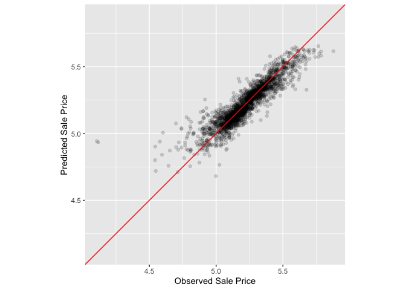<!-- -->

Tails, and particularly, lower tail has overestimates with high
variance. Upper tail has underestimates.

``` r
over_predicted <- 
  assess_res %>% 
  mutate(residual = Sale_Price - .pred) %>% 
  arrange(desc(abs(residual))) %>% 
  slice(1:10)
over_predicted
```

    ## # A tibble: 10 × 5
    ##     .row Sale_Price .config              .pred residual
    ##    <int>      <dbl> <chr>                <dbl>    <dbl>
    ##  1    33       4.11 Preprocessor1_Model1  4.94   -0.836
    ##  2   317       4.12 Preprocessor1_Model1  4.93   -0.817
    ##  3   319       4.60 Preprocessor1_Model1  5.01   -0.404
    ##  4   406       4.70 Preprocessor1_Model1  5.08   -0.377
    ##  5   141       4.58 Preprocessor1_Model1  4.94   -0.360
    ##  6   569       4.54 Preprocessor1_Model1  4.90   -0.358
    ##  7  2295       5.68 Preprocessor1_Model1  5.33    0.350
    ##  8   172       4.78 Preprocessor1_Model1  5.12   -0.344
    ##  9    83       4.92 Preprocessor1_Model1  5.26   -0.339
    ## 10   143       5.00 Preprocessor1_Model1  4.68    0.316

Well, lets look these houses individually.

``` r
ames_train %>% 
  slice(over_predicted$.row) %>% 
  select(Gr_Liv_Area, Neighborhood, Year_Built, Bedroom_AbvGr, Full_Bath)
```

    ## # A tibble: 10 × 5
    ##    Gr_Liv_Area Neighborhood           Year_Built Bedroom_AbvGr Full_Bath
    ##          <int> <fct>                       <int>         <int>     <int>
    ##  1         832 Old_Town                     1923             2         1
    ##  2         733 Iowa_DOT_and_Rail_Road       1952             2         1
    ##  3        1317 Iowa_DOT_and_Rail_Road       1920             3         1
    ##  4        1484 Iowa_DOT_and_Rail_Road       1910             3         2
    ##  5         968 Old_Town                     1910             2         1
    ##  6         498 Edwards                      1922             1         1
    ##  7        3608 Old_Town                     1892             4         2
    ##  8        1276 Edwards                      1958             3         1
    ##  9        1411 Northwest_Ames               1977             3         2
    ## 10         792 Old_Town                     1923             2         1

## Modeling with validation

``` r
val_res <- 
  rf_wflow %>% 
  fit_resamples(resamples = val_set)
val_res
```

    ## # Resampling results
    ## # Validation Set Split (0.75/0.25)  
    ## # A tibble: 1 × 4
    ##   splits             id         .metrics         .notes          
    ##   <list>             <chr>      <list>           <list>          
    ## 1 <split [1756/586]> validation <tibble [2 × 4]> <tibble [0 × 3]>

Get performance metrics.

``` r
collect_metrics(x = val_res)
```

    ## # A tibble: 2 × 6
    ##   .metric .estimator   mean     n std_err .config             
    ##   <chr>   <chr>       <dbl> <int>   <dbl> <chr>               
    ## 1 rmse    standard   0.0702     1      NA Preprocessor1_Model1
    ## 2 rsq     standard   0.839      1      NA Preprocessor1_Model1

# Parallel programming

Detect number of cores (CPUs) in your local machine along with the
number that can be used in parallel calculations.

``` r
parallel::detectCores(logical = FALSE)
```

    ## [1] 8

``` r
parallel::detectCores(logical = TRUE)
```

    ## [1] 8

Register parallel backend package (macOS).

``` r
library(doMC)
```

    ## Loading required package: foreach

    ## 
    ## Attaching package: 'foreach'

    ## The following objects are masked from 'package:purrr':
    ## 
    ##     accumulate, when

    ## Loading required package: iterators

    ## Loading required package: parallel

``` r
registerDoMC(cores = 4)
# now fit
val_res <- 
  rf_wflow %>% 
  fit_resamples(resamples = val_set)
collect_metrics(x = val_res)
```

    ## # A tibble: 2 × 6
    ##   .metric .estimator   mean     n std_err .config             
    ##   <chr>   <chr>       <dbl> <int>   <dbl> <chr>               
    ## 1 rmse    standard   0.0699     1      NA Preprocessor1_Model1
    ## 2 rsq     standard   0.840      1      NA Preprocessor1_Model1

OR like below:  

``` r
# All operating systems
library(doParallel)

# Create a cluster object and then register: 
cl <- makePSOCKcluster(8)
registerDoParallel(cl)

# Now run fit_resamples()`...
val_res <- 
  rf_wflow %>% 
  fit_resamples(resamples = val_set)
collect_metrics(x = val_res)
```

    ## # A tibble: 2 × 6
    ##   .metric .estimator   mean     n std_err .config             
    ##   <chr>   <chr>       <dbl> <int>   <dbl> <chr>               
    ## 1 rmse    standard   0.0701     1      NA Preprocessor1_Model1
    ## 2 rsq     standard   0.839      1      NA Preprocessor1_Model1

``` r
stopCluster(cl)
```

Tidymodels is powerful, it uses the many other packages that already
existed in R ecosystem, but combines them in a uniform way.
